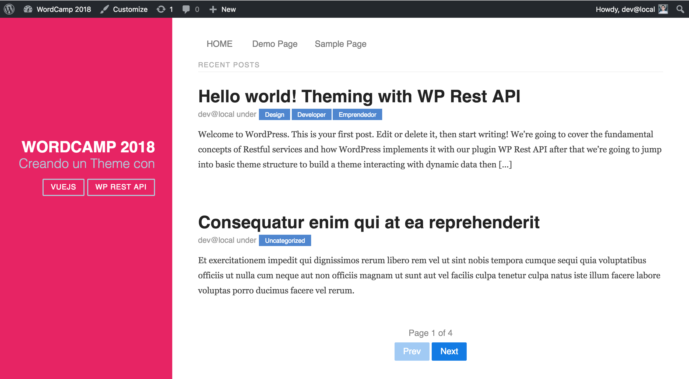

# Creando un Theme con WP Rest API + VueJS

## Introducción
Este proyecto es una contribución para comunidad de Wordpress y la conferencia WordCamp 2018 en San José, Costa Rica. 

Abordamos los fundamentos sobre cómo crear un Theme usando el Plugin WP Rest API y la librería Vue.JS para consumir la información desde el frontend.

### Proyecto
Construir un Theme usando el potencial del concepto ‘Headless CMS’ para articular nuestros equipos de trabajo eficientemente.

### Recursos
- [Presentación](https://www.slideshare.net/brojask/creando-un-theme-con-wp-rest-api-107175552)
- [Rest API Handbook](https://developer.wordpress.org/rest-api/)
- [Vue.js by Example(free course)](https://coursetro.com/courses/23/Vue-Tutorial-in-2018---Learn-Vue.js-by-Example)
- [Wordpress Code Reference](https://developer.wordpress.org/reference
)
- [Advanced Custom Fields](https://www.advancedcustomfields.com/resources/getting-started-with-acf/)
- [Talking to 25% of the web](https://humanmade.com/wordpress-rest-api-white-paper/)

## Requerimientos

### Instalar Vagrant Box
- [Scotch Box(LAMP /LEMP)](https://box.scotch.io/)

### Instalar Wordpress

### [Instalar Advanced Custom Fields](https://www.advancedcustomfields.com/)
* Agregar campos:
    + location(map)
    + time(datepicker)

### [Instalar FakerPress](https://es.wordpress.org/plugins/fakerpress/)
